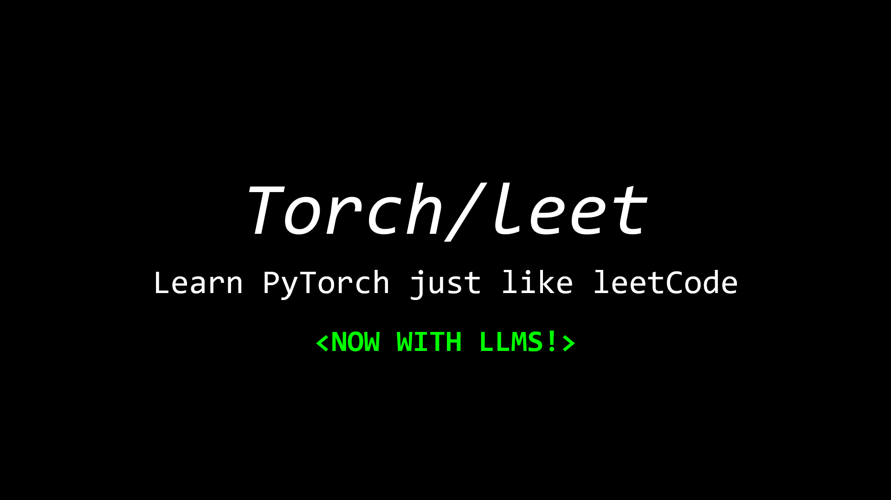

  
  <!-- <h1>TorchLeet</h1> -->
  

    🐦 <a href="https://twitter.com/charoori_ai">Follow me on Twitter</a> •
    ➡️ <a href="https://github.com/Exorust/TorchLeet/tree/new-llm?tab=readme-ov-file#llm-set">Jump to LLMs!</a>
    📧 <a href="mailto:chandrahas.aroori@gmail.com?subject=Torchleet">Feedback</a>
  

  

    
  

 

> I struggled to grind for ML/AI interviews so I went back to the basics and created a list after careful research. 

TorchLeet is broken into two sets of questions:
1. **Question Set**: A collection of PyTorch practice problems, ranging from basic to hard, designed to enhance your skills in deep learning and PyTorch.
2. **LLM Set**: A new set of questions focused on understanding and implementing Large Language Models (LLMs) from scratch, including attention mechanisms, embeddings, and more.

> [!NOTE]
> Avoid using GPT. Try to solve these problems on your own. The goal is to learn and understand PyTorch concepts deeply.

>  [!NOTE] 
> Yes. I used GPT to help write the code and I ended up testing it out myself as practise. I found the strategy to be super useful

## Table of Contents
- [Question Set](#question-set)
   - [🔵Basic](#basic)
   - [🟢Easy](#easy)
   - [🟡Medium](#medium)
   - [🔴Hard](#hard)
- [LLM Set](#llm-set)
- [Getting Started](#getting-started)
   - [1. Install Dependencies](#1-install-dependencies)
   - [2. Structure](#2-structure)
   - [3. How to Use](#3-how-to-use)
- [Contribution](#contribution)

## Question Set

### 🔵Basic
Mostly for beginners to get started with PyTorch.

1. [Implement linear regression](torch/basic/lin-regression/lin-regression.ipynb) [(Solution)](torch/basic/lin-regression/lin-regression_SOLN.ipynb)
2. [Write a custom Dataset and Dataloader to load from a CSV file](torch/basic/custom-dataset/custom-dataset.ipynb) [(Solution)](torch/basic/custom-dataset/custom-dataset_SOLN.ipynb)
3. [Write a custom activation function (Simple)](torch/basic/custom-activation/custom-activation.ipynb) [(Solution)](torch/basic/custom-activation/custom-activation_SOLN.ipynb)
4. [Implement Custom Loss Function (Huber Loss)](torch/basic/custom-loss/custom-loss.ipynb) [(Solution)](torch/basic/custom-loss/custom-loss_SOLN.ipynb)
5. [Implement a Deep Neural Network](torch/basic/custom-DNN/custon-DNN.ipynb) [(Solution)](torch/basic/custom-DNN/custon-DNN_SOLN.ipynb)
6. [Visualize Training Progress with TensorBoard in PyTorch](torch/basic/tensorboard/tensorboard.ipynb) [(Solution)](torch/basic/tensorboard/tensorboard_SOLN.ipynb)
7. [Save and Load Your PyTorch Model](torch/basic/save-model/save_model.ipynb) [(Solution)](torch/basic/save-model/save_model_SOLN.ipynb)
8. Implement Softmax function from scratch *(Coming Soon)*

---

### 🟢Easy
Recommended for those who have a basic understanding of PyTorch and want to practice their skills.
1. [Implement a CNN on CIFAR-10](torch/easy/cnn/CNN.ipynb) [(Solution)](torch/easy/cnn/CNN_SOLN.ipynb)  
2. [Implement an RNN from Scratch](torch/easy/rnn/RNN.ipynb) [(Solution)](torch/easy/rnn/RNN_SOLN.ipynb)  
3. [Use `torchvision.transforms` to apply data augmentation](torch/easy/augmentation/augmentation.ipynb) [(Solution)](torch/easy/augmentation/augmentation_SOLN.ipynb)  
4. [Add a benchmark to your PyTorch code](torch/easy/benchmark/bench.ipynb) [(Solution)](torch/easy/benchmark/bench_SOLN.ipynb)  
5. [Train an autoencoder for anomaly detection](torch/easy/autoencoder/autoencoder.ipynb) [(Solution)](torch/easy/autoencoder/autoencoder_SOLN.ipynb)
6. [Quantize your language model](torch/easy/quantize-lm/quantize-language-model.ipynb) [(Solution)](torch/easy/quantize-lm/quantize-language-model_SOLN.ipynb)
7. [Implement Mixed Precision Training using torch.cuda.amp](torch/easy/cuda-amp/cuda-amp.ipynb) [(Solution)](torch/easy/cuda-amp/cuda-amp_SOLN.ipynb)
   
---

### 🟡Medium
These problems are designed to challenge your understanding of PyTorch and deep learning concepts. They require you to implement things from scratch or apply advanced techniques.
1. [Implement parameter initialization for a CNN](torch/medium/cnn-param-init/CNN_ParamInit.ipynb) [(Solution)](torch/medium/cnn-param-init/CNN_ParamInit_SOLN.ipynb)
2. [Implement a CNN from Scratch](torch/medium/cnn-scratch/CNN_scratch.ipynb) [(Solution)](torch/medium/cnn-scratch/CNN_scratch_SOLN.ipynb)
3. [Implement an LSTM from Scratch](torch/medium/lstm/LSTM.ipynb) [(Solution)](torch/medium/lstm/LSTM_SOLN.ipynb)
4. Implement AlexNet from scratch *(Coming Soon)*
5. Build a Dense Retrieval System using PyTorch *(Coming Soon)*
6. Implement KNN from scratch in PyTorch *(Coming Soon)*
7. [Train a 3D CNN network for segmenting CT images](torch/medium/3dcnn/3DCNN.ipynb) [(Solution)](torch/medium/3dcnn/3DCNN_SOLN.ipynb)

---

### 🔴Hard
These problems are for advanced users who want to push their PyTorch skills to the limit. They involve complex architectures, custom layers, and advanced techniques.
1. [Write a custom Autograd function for activation (SILU)](torch/hard/custom-autograd/custom-autgrad-function.ipynb) [(Solution)](torch/hard/custom-autograd/custom-autgrad-function_SOLN.ipynb)
2. Write a Neural Style Transfer *(Coming Soon)*
3. Build a Graph Neural Network (GNN) from scratch *(Coming Soon)*
4. Build a Graph Convolutional Network (GCN) from scratch *(Coming Soon)*
5. [Write a Transformer](torch/hard/transformer/transformer.ipynb) [(Solution)](torch/hard/transformer/transformer_SOLN.ipynb)
6. [Write a GAN](torch/hard/GAN/GAN.ipynb) [(Solution)](torch/hard/GAN/GAN_SOLN.ipynb)
7. [Write Sequence-to-Sequence with Attention](torch/hard/seq-seq/seq-to-seq-with-Attention.ipynb) [(Solution)](torch/hard/seq-seq/seq-to-seq-with-Attention_SOLN.ipynb)
8. Enable distributed training in pytorch (DistributedDataParallel) *(Coming Soon)*
9. Work with Sparse Tensors *(Coming Soon)*
10. [Add GradCam/SHAP to explain the model.](torch/hard/xai/xai.ipynb) [(Solution)](torch/hard/xai/xai_SOLN.ipynb)
11. Linear Probe on CLIP Features *(Coming Soon)*
12. Add Cross Modal Embedding Visualization to CLIP (t-SNE/UMAP) *(Coming Soon)*
13. Implement a Vision Transformer *(Coming Soon)*
14. Implement a Variational Autoencoder *(Coming Soon)*

---

## LLM Set

**An all new set of questions to help you understand and implement Large Language Models from scratch.**

Each question is designed to take you one step closer to building your own LLM.

1. [Implement RMS Norm](llm/01-RMS-Norm/rms-norm.ipynb)
2. [Implement Sinusoidal Positional Embeddings](llm/02-Sinusoidal-Positional-Embedding/sinusoidal-q7-Question.ipynb) [(Solution)](llm/02-Sinusoidal-Positional-Embedding/sinusoidal-q7.ipynb)
3. [Implement Attention from Scratch](llm/03-Implement-Attention-from-Scratch/attention-q4-Question.ipynb) [(Solution)](llm/03-Implement-Attention-from-Scratch/attention-q4.ipynb) - Includes KV Cache
4. [Implement Multi-Head Attention from Scratch](llm/04-Multi-Head-Attention/multi-head-attention-q5-Question.ipynb) [(Solution)](llm/04-Multi-Head-Attention/multi-head-attention-q5.ipynb) - Includes KV Cache
5. [Implement Byte Pair Encoding from Scratch](llm/05-Byte-Pair-Encoder/BPE-q3-Question.ipynb) [(Solution)](llm/05-Byte-Pair-Encoder/BPE-q3.ipynb)
6. [Implement RoPE (Rotary Positional Embeddings)](llm/06-Rotary-Positional-Embedding/rope-q8-Question.ipynb) [(Solution)](llm/06-Rotary-Positional-Embedding/rope-q8.ipynb)
7. [Implement Grouped Query Attention from Scratch](llm/07-Grouped-Query-Attention/grouped-query-attention-Question.ipynb) [(Solution)](llm/07-Grouped-Query-Attention/grouped-query-attention.ipynb) - Includes GQA + KV Cache memory savings
8. [Implement KV Cache in Multi-Head Attention](llm/08-KV-Cache/kv-cache-Question.ipynb) [(Solution)](llm/08-KV-Cache/kv-cache.ipynb)
9. [Implement KL Divergence Loss](llm/09-KL-Divergence-Loss/kl-divergence-Question.ipynb) [(Solution)](llm/09-KL-Divergence-Loss/kl-divergence.ipynb)
10. [Create Embeddings from an LLM](llm/10-Create-Embeddings-out-of-an-LLM/embeddings-q2.ipynb) - Extract sentence embeddings using SmolLM2-135M
11. [Implement Temperature Sampling](llm/11-Temperature-Sampling/temperature-sampling-Question.ipynb) [(Solution)](llm/11-Temperature-Sampling/temperature-sampling.ipynb) - Control randomness in text generation
12. [Implement Top-K and Top-P (Nucleus) Sampling](llm/12-Top-K-Top-P-Sampling/sampling-Question.ipynb) [(Solution)](llm/12-Top-K-Top-P-Sampling/sampling.ipynb) - Filter token distributions for quality
13. [Implement Beam Search](llm/13-Beam-Search/beam-search-Question.ipynb) [(Solution)](llm/13-Beam-Search/beam-search.ipynb) - Search-based decoding with length normalization
14. [Implement LoRA (Low-Rank Adaptation)](llm/14-LoRA/lora-Question.ipynb) [(Solution)](llm/14-LoRA/lora.ipynb) - Parameter-efficient fine-tuning
15. [Implement SmolLM from Scratch](llm/15-SmolLM/smollm-q12-Question.ipynb) [(Solution)](llm/15-SmolLM/smollm-q12.ipynb)
16. [Implement Flash Attention Forward Kernel with Triton](llm/flash-attention.ipynb) - Optimize attention computation with tiling
17. [Implement INT8 Quantization](llm/17-Quantization/quantization-Question.ipynb) [(Solution)](llm/17-Quantization/quantization.ipynb) - Reduce model memory with per-channel quantization
18. Implement QLoRA (Quantized LoRA) *(Coming Soon)*
19. Implement Predictive Prefill with Speculative Decoding *(Coming Soon)*
20. Mix two models to create a Mixture of Experts *(Coming Soon)*
21. Apply SFT on SmolLM *(Coming Soon)*
22. Apply RLHF on SmolLM *(Coming Soon)*
23. Implement DPO based RLHF *(Coming Soon)*
24. Add continuous batching to your LLM *(Coming Soon)*
25. Chunk Textual Data for Dense Passage Retrieval *(Coming Soon)*
26. Implement Large scale Training => 5D Parallelism *(Coming Soon)*

## Paper Reimplementations

Practice by reimplementing key ideas from research papers:

1. [GLP Meta-Model](papers/glp-meta-model/) - GLP meta-model paper implementation
2. [MFA Local Geometry](papers/mfa-local-geometry/) - MFA local geometry paper implementation
3. [Doc-to-LoRA](papers/doc-to-lora/doc-to-lora-Question.ipynb) [(Solution)](papers/doc-to-lora/doc-to-lora.ipynb) - Hypernetwork that generates LoRA adapters from documents in a single forward pass ([Charakorn et al., 2026](https://arxiv.org/abs/2602.15902))
   - [Doc-to-LoRA v2](papers/doc-to-lora/doc-to-lora-2-Question.ipynb) [(Solution)](papers/doc-to-lora/doc-to-lora-2.ipynb) - 30-min focused rebuild: Perceiver aggregator, top-K distillation loss, HyperLoRA head, end-to-end pipeline
4. [Concept Influence](papers/concept-influence/concept-influence-Question.ipynb) [(Solution)](papers/concept-influence/concept-influence.ipynb) - Training data attribution via linear probes and Vector Filter ([Kowal et al., 2025](https://arxiv.org/abs/2602.14869))
5. [TRAK](papers/trak/trak-Question.ipynb) [(Solution)](papers/trak/trak.ipynb) - Scalable training data attribution using random projections and the Johnson-Lindenstrauss lemma ([Park et al., 2023](https://arxiv.org/abs/2303.14186))
6. [Influence Functions](papers/influence-functions/influence-functions-Question.ipynb) [(Solution)](papers/influence-functions/influence-functions.ipynb) - Classical training data attribution via inverse-Hessian vector products ([Koh & Liang, 2017](https://arxiv.org/abs/1703.04730))
7. [TrackStar](papers/trackstar/trackstar-Question.ipynb) [(Solution)](papers/trackstar/trackstar.ipynb) - Scalable influence and fact tracing for LLM pretraining via EKFAC preconditioning, preconditioner mixing, and FAISS indexing ([Chang et al., 2024](https://arxiv.org/abs/2410.17413))
8. [EKFAC](papers/ekfac/ekfac-Question.ipynb) [(Solution)](papers/ekfac/ekfac.ipynb) - Eigenvalue-corrected Kronecker-Factored Approximate Curvature for efficient Hessian approximation in influence functions ([George et al., NeurIPS 2018](https://arxiv.org/abs/1806.03884))

## Applied ML Practice

Hands-on practice problems for real-world ML engineering:

1. [LLM-as-Judge](practice/01-LLM-as-Judge/) - LLM evaluation as judge
2. [Agent Eval Harness](practice/02-Agent-Eval-Harness/) - Agent evaluation harness
3. [Codenames AI](practice/03-Codenames-AI/) - AI for Codenames board game
4. [Safety Evaluation Pipeline](practice/04-Safety-Evaluation-Pipeline/isc-safety-eval-Question.ipynb) [(Solution)](practice/04-Safety-Evaluation-Pipeline/isc-safety-eval.ipynb) - Red-team campaign analysis pipeline based on Internal Safety Collapse ([Wu et al., 2026](https://arxiv.org/abs/2603.23509)): harm taxonomy, attack success rates, Cohen's kappa, bootstrap CIs, policy compliance gaps, campaign heatmaps, and prioritization scoring

---

**What's cool? 🚀**
- **Diverse Questions**: Covers beginner to advanced PyTorch concepts (e.g., tensors, autograd, CNNs, GANs, and more).
- **Guided Learning**: Includes incomplete code blocks (`...` and `#TODO`) for hands-on practice along with Answers

## Getting Started

### 1. Install Dependencies
- Install pytorch: [Install pytorch locally](https://pytorch.org/get-started/locally/)
- Some problems need other packages. Install as needed.

### 2. Structure
- `<E/M/H><ID>/`: Easy/Medium/Hard along with the question ID.
- `<E/M/H><ID>/qname.ipynb`: The question file with incomplete code blocks.
- `<E/M/H><ID>/qname_SOLN.ipynb`: The corresponding solution file.

### 3. How to Use
- Navigate to questions/ and pick a problem
- Fill in the missing code blocks `(...)` and address the `#TODO` comments.
- Test your solution and compare it with the corresponding file in `solutions/`.

**Happy Learning! 🚀**

# Contribution
Feel free to contribute by adding new questions or improving existing ones. Ensure that new problems are well-documented and follow the project structure. Submit a PR and tag the authors.

# Authors

  <table>
    <tr>
      <td align="center">
        <a href="https://github.com/Exorust">
          
           
          <b>Chandrahas Aroori</b>
        </a>
         
        💻 AI/ML Dev
         
         
        
        
      </td>
      <td align="center">
        <a href="https://github.com/CaslowChien">
          
           
          <b>Caslow Chien</b>
        </a>
         
        💻 Developer
         
         
        
        
      </td>
    </tr>
  </table>

                        
## Stargazers over time

